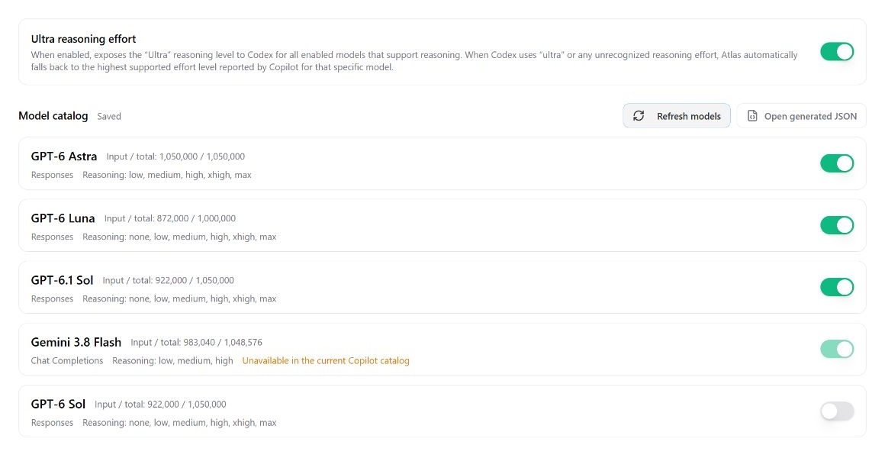
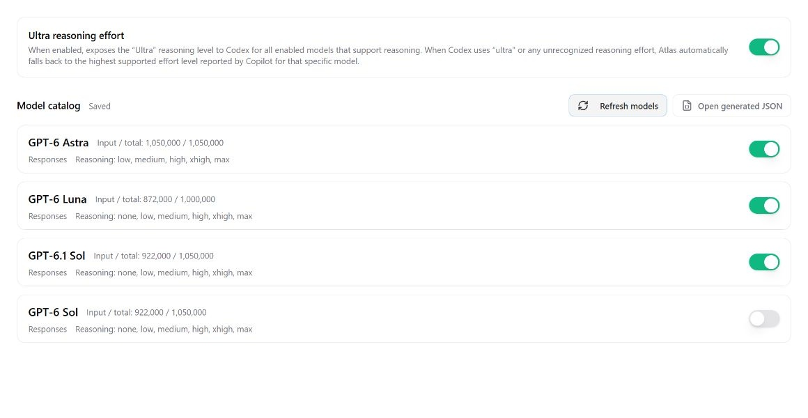

# Model catalog refresh review

Both screenshots render the production Settings component with identical
synthetic saved models and Copilot responses. They show the result of clicking
**Refresh models**, with a 1280 px browser width and the images cropped to the
model controls.

- **Before:** Atlas 6.0.2, commit `5040860c57a532e2f4a37a3f708b5347e6a0211d`.
- **After:** Atlas 6.0.3 in this pull request.
- **Captured:** October 7, 2026, in the Codex in-app browser, English, light theme.

The synthetic Copilot response omits Gemini 3.8 Flash. Refresh now removes its
saved row and preferences. GPT-6 Sol is still returned by Copilot, so its row
remains with the user's enable switch off. Other model controls retain their
existing layout.

| Before refresh behavior | New refresh behavior |
| --- | --- |
|  |  |

Frontend tests cover returning models receiving fresh defaults, empty and
ineligible catalogs, failed refreshes, and results from a previously selected
account. Rust tests verify removal across database reopen, regenerated catalog
contents, and clearing the generated catalog after a successful empty refresh.
