# Context integrity and model/cache display review

These comparisons render the production React components using the same
synthetic data, browser, viewport, and theme. They are component previews, not
screenshots of private account or request data.

- **Before:** Atlas 6.0.1, commit `41fb6a7ade7471d8e4e49306bc01f4c8e6d1a544`.
- **After:** this pull request's implementation.
- **Capture:** October 1, 2026; Windows Edge; 1200 × 1000 viewport; scale 1;
  English locale and Asia/Shanghai timezone. Images are cropped to the component.

## Settings model catalog

The protocol is plain text immediately before Reasoning. The vendor/image/parallel
tools line is removed. Protocol selection follows the router's Responses-first
preference, using saved metadata from Copilot's advertised endpoints.

| Before | After |
| --- | --- |
| 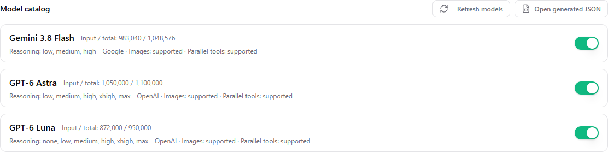 | 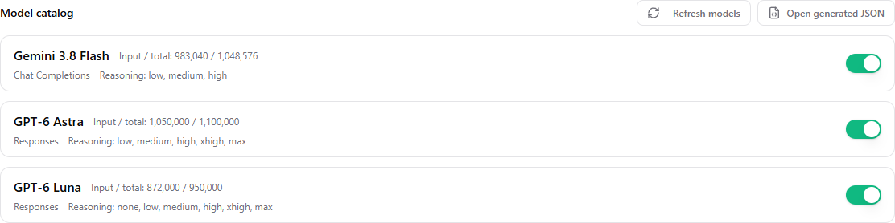 |

## Overview requests

Input (fresh/cached/hit) replaces Pricing Tier. Duration follows Input.

| Before | After |
| --- | --- |
| 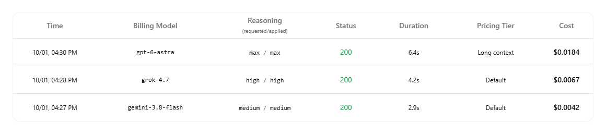 | 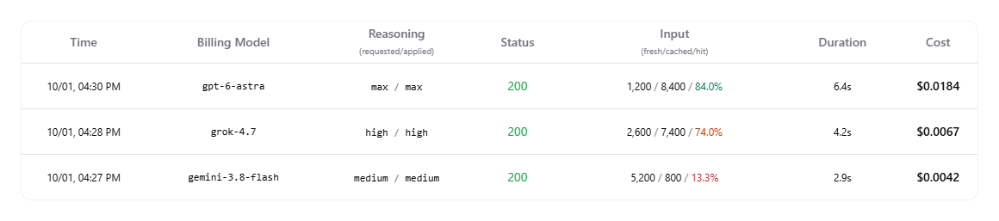 |

## Cache-hit colors

Rates below 50% are red; 50% through less than 80% are orange; 80% and above are
green. Unknown rates remain neutral. Thresholds use the unrounded numeric rate,
and cache writes remain in the denominator.

| Before | After |
| --- | --- |
| 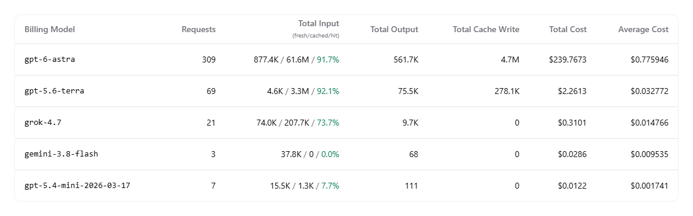 | 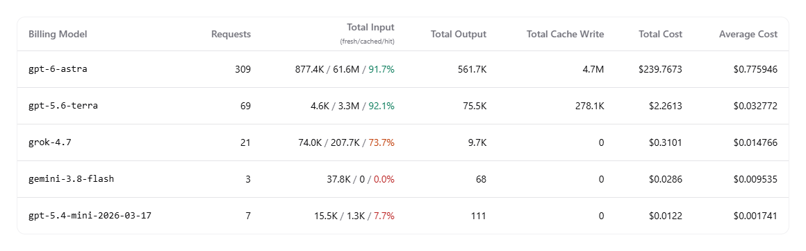 |
| 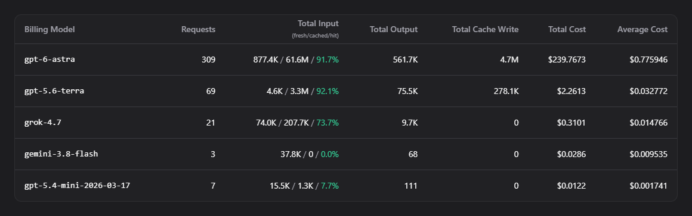 | 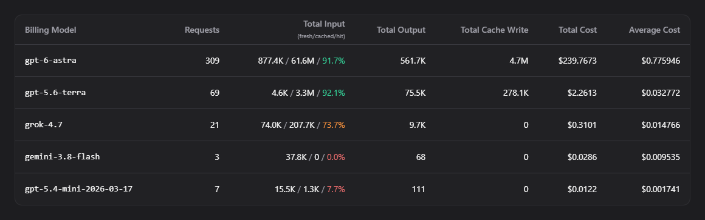 |
| 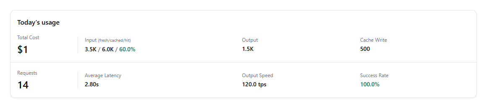 | 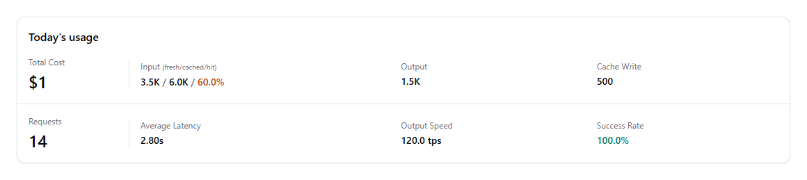 |

## Usage request table retains its layout

All ten columns, their order, Pricing Tier, and saved column preferences are
unchanged. Only the shared cache-hit percentage color changes.

| Before | After |
| --- | --- |
| 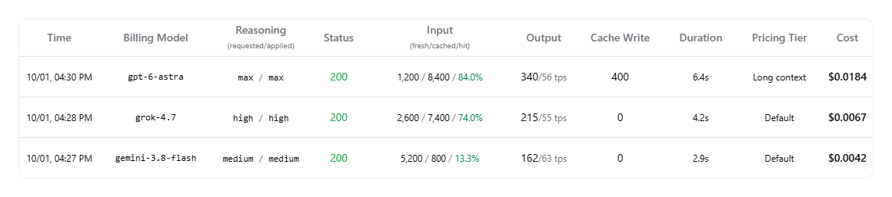 | 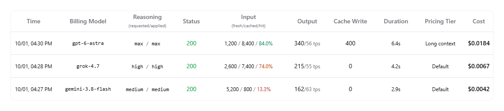 |

## Context verification

- Rust regressions assert that appended instructions leave the prior converted
  message array and tool definitions intact.
- Both non-native adapters reject `compaction` and `item_reference` inputs in
  array and single-object form. Nested application data in tool results is not
  mistaken for an opaque history item.
- The installed Codex backend was exercised with the actual local model catalog
  against a synthetic local server: four models, 20 ordinary turns each,
  an early tool result, and collaboration-mode changes (96 requests).
  The patched converter retained the early result and did not rewrite the initial
  system message on mode changes.
- A synthetic Gemini 3.8 Flash request through the Copilot Chat endpoint returned
  HTTP 200 with tool history and an interleaved later system message. The model
  returned the requested marker from the later instruction.

These checks establish request integrity and upstream acceptance. They do not
measure provider cache-hit improvement or general model task accuracy.
