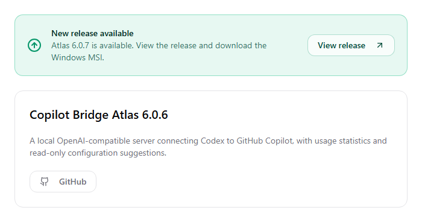
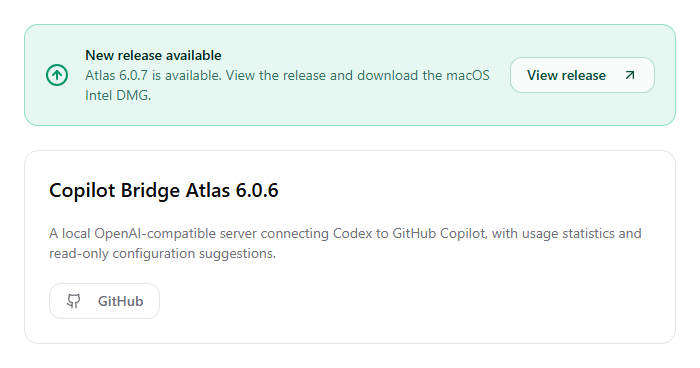
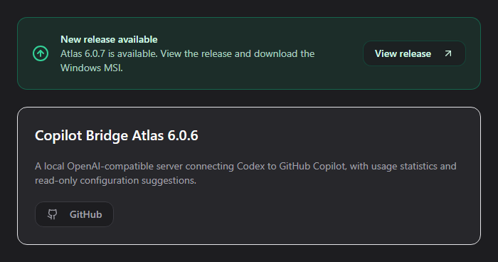
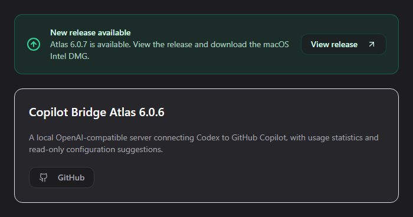

# macOS Intel release wording review

These screenshots render the actual About component with the application's
existing CSS, using matching synthetic fixtures: installed version 6.0.6,
available release 6.0.7, and a 700-pixel-wide content panel.

Before uses Atlas 6.0.6 (`00434f058f78e2e28f84b13dadf86065d1c27b00`).
After uses this PR with the macOS build environment. The release notice says
**macOS Intel DMG** on Mac and keeps **Windows MSI** on Windows.

| Before | After on macOS |
| --- | --- |
|  |  |
|  |  |

The screenshots differ only within the release notice's download text. The
cards, buttons, spacing, icon artwork, and release link behavior are unchanged.
The browser fixture used no private account data and reported no runtime errors.
