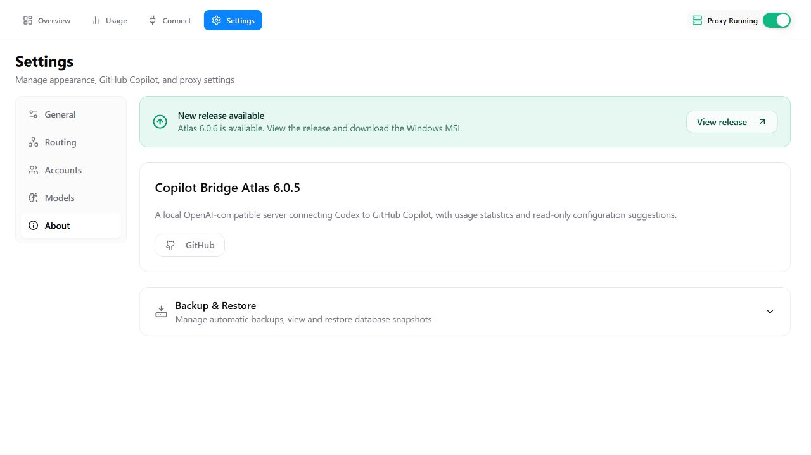
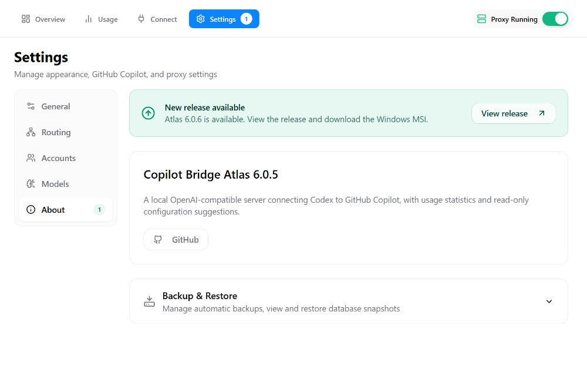
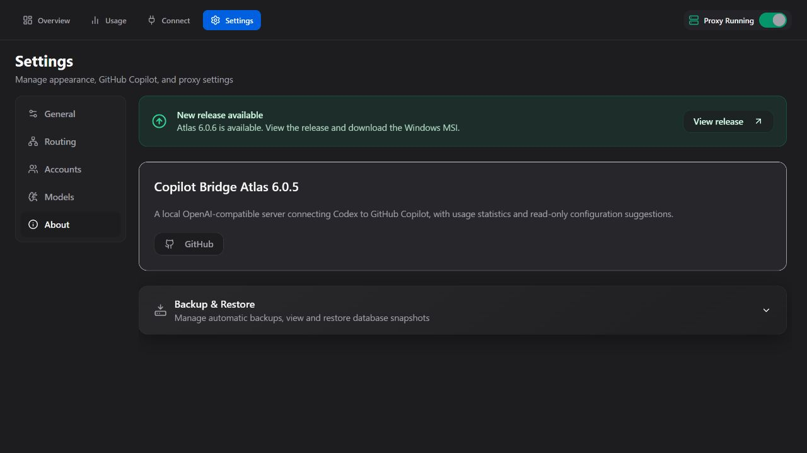
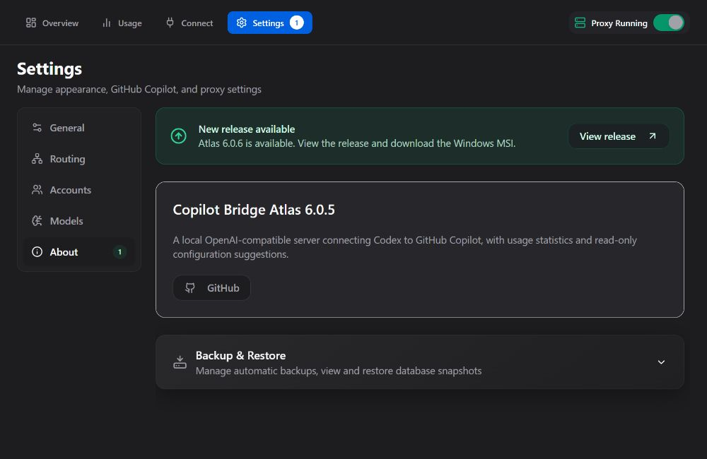
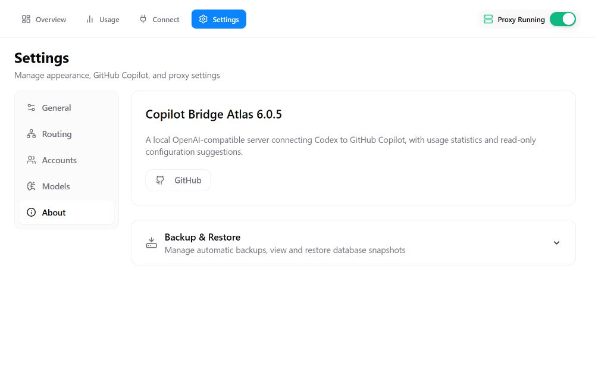

# Update notification badge review

The screenshots render the actual application navigation, Settings page, and
About component with identical synthetic version and settings fixtures.

- **Before:** Atlas 6.0.5, commit `1bf16aa740fd5ba374fb646549834d8c2fd8364f`.
- **After:** this pull request's implementation for Atlas 6.0.6.
- **Fixtures:** installed version 6.0.5, newer release 6.0.6, proxy running.
- **Capture:** 1000 × 650 viewport, English, matching light or dark appearance.

The top-level Settings badge is visible before opening Settings. The About
badge sits at the right edge of its sidebar item. Selected Settings uses a
white badge; other badges use a subtle green fill. The existing About release
banner keeps its layout and download behavior.

| Before | After |
| --- | --- |
|  |  |
|  |  |

Both badges and the banner use one application-level release result. Opening
About, navigating away, or viewing the release does not dismiss them. A
successful check reporting no newer release removes both badges and the banner.
Initial network failures leave the application usable without an update notice.

Browser checks also confirmed no horizontal overflow at the minimum supported
900 × 600 window size and no runtime errors. API results and unrelated Overview
components were replaced with local fixtures; no private account data or live
configuration was used.
